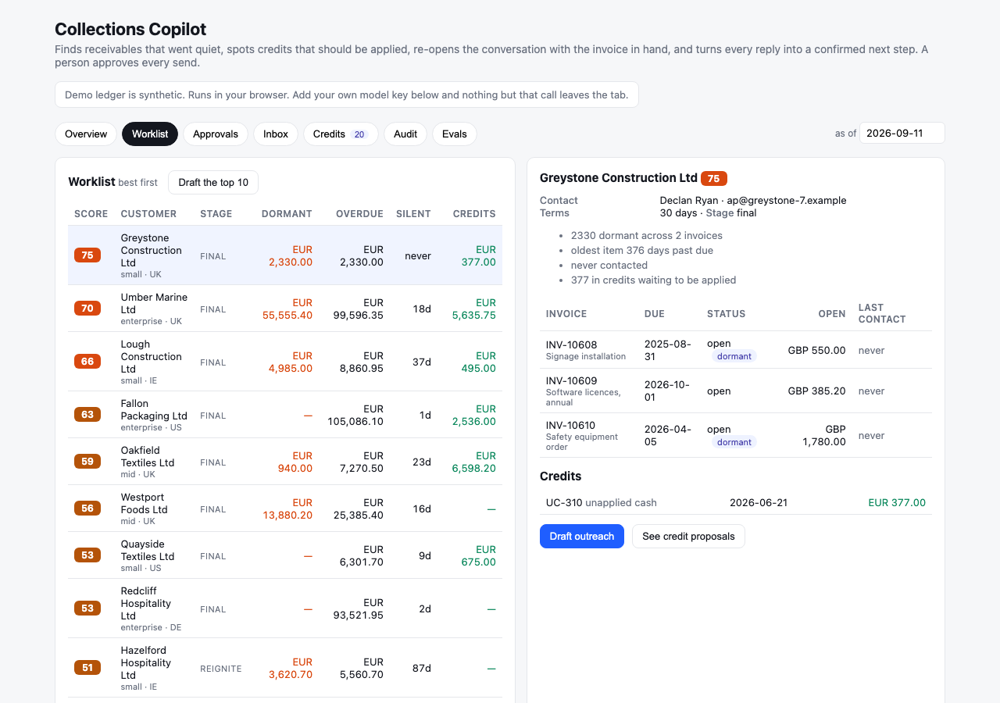

# Collections Copilot

[](https://github.com/harshalsahetiya94-oss/collections-copilot/actions/workflows/ci-and-pages.yml)

**Live demo: https://harshalsahetiya94-oss.github.io/collections-copilot/** (synthetic ledger, runs in the browser)

Finds receivables that went quiet, spots credits that should have been applied, re-opens the conversation with the invoice in hand, and turns every reply into a confirmed next step. **A person approves every send.**



## The problem it works on

In every receivables book there is a tail of invoices nobody is talking about: past due for months, no dispute logged, no call made, no reply. They are not bad debt yet. They are abandoned. At the same time the same book holds credit notes and unapplied cash that nobody matched to anything. The work is not clever; it is finding those two lists, putting the right invoice in front of the right person with a clear question, and following through on the answer. That is what this does.

I built the enterprise version of this problem's first half inside a large finance function (the aging-tail analytics and the collector-assistant that came out of it won internal awards). This is the shape of that idea as an open, synthetic, end-to-end system.

## What it does, in order

1. **Dormancy.** An invoice is dormant when it is past due by `dormantAfterDaysPastDue` (90) and nobody has spoken to the customer for `noContactDays` (30), or ever. Disputed items are excluded: disputes are a different desk.
2. **Worklist.** Every account with overdue items or credits is scored 0–100 from dormant amount, oldest age, silence, credits on hand (an easy win), and whether the whole book is disputed (a penalty). Each score comes with its reasons in plain words.
3. **Credits.** Credit notes and unapplied cash are matched: exact matches first (a credit equal to an open invoice is almost always meant for it), then oldest credit to oldest invoice. Customers in net credit are named for a refund or a hold.
4. **Outreach.** A draft email per account, staged by age (reminder → overdue → re-ignite → final), with the invoice list, the credit note if there is one, the copies attached, and **four numbered ways to reply**: paid (date and reference), scheduled (a date), something is wrong (what), or missing (resend to whom). The tone never threatens; a banned-word list enforces it.
5. **The check.** Before a person sees a draft, every invoice number and amount in it is verified against the ledger, banned words are flagged, and the confirmation ask must be present. A draft that fails cannot be approved.
6. **Approval.** A human reads, edits, approves or rejects. Sending is simulated in the demo; the state machine is real.
7. **Replies.** Each reply is classified into paid / promise to pay / dispute / needs copy / apply credit / question / unclear, with the date, amount, reference or reason extracted, and mapped to a next action: trace the payment, schedule a follow-up the day after the promised date, route the dispute and pause chasing, resend to the named contact, apply the credit, answer, or escalate to a person. Silence past the follow-up date surfaces as "chase again at the next stage".
8. **Audit.** Every draft, edit, approval, block, classification and action is logged with who did it.

## Rules first, model last

About 80% of the decisions here are deterministic and tested: dormancy, scoring, credit matching, staging, the draft's facts, and the reply's intent whenever the wording is clear. The model is used for two things only: rewriting the template in a warmer voice, and reading replies the rules are unsure about. Every model draft goes through the same fact check as a template draft. Every model classification is labelled as the model's.

Measured on the 36 labelled replies in `public/demo/replies.json` (`docs/EVALS-LLM.md`):

| Approach | Accuracy | Model calls |
|---|---|---|
| Rules only | 1.00 | 0 |
| Model only (claude-haiku-4-5) | 0.89 | 36 |
| Rules first, model only when rules are unsure | 1.00 | 3 |

Two honest caveats. The rules were tuned on this same set, so the rules-only number is flattering; the model comparison is the fairer read of the method. And when the model rewrote 14 drafts for the demo, the fact checker rejected 2 (amount 99,636.65 does not match the ledger / does not ask for a confirmation with the numbered options). Those drafts are still in the demo, marked as failing, and cannot be approved until a person fixes them. That is exactly what the check is there for.

Other numbers, on the synthetic ledger (`docs/EVALS.md`):

| Check | Result |
|---|---|
| Dormant detection vs the generator's hidden truth | precision 0.96, recall 0.93, F1 0.94 |
| Exact credit matches vs the intended pairs | precision 1.00, recall 1.00 |
| Template drafts passing the fact check | 42 of 42 |

Recall on dormancy is below 1 by design: the generator sometimes sends an automated statement to a silent customer, which resets "last contact" without anyone speaking to them. The rule counts that as contact; the truth does not. That gap is the argument for logging *who* spoke, not just *that* something went out.

## Try it

Open the [live demo](https://harshalsahetiya94-oss.github.io/collections-copilot/). Worklist → pick the top account → *Draft outreach* → Approvals → approve → Inbox → *Simulate the customer's reply* → watch the next step appear → *Mark done*. The Credits tab proposes applications; the Audit tab shows the trail; the Evals tab recomputes the numbers in your browser.

Paste your own model key on the Overview tab and the drafts are personalised live, replies the rules cannot read go to the model, and the model plays the customer. The key stays in memory in the tab. Without a key, the demo uses drafts and replies pre-generated once with the same model.

## Run it

```bash
npm install
npm run data        # regenerate the synthetic ledger (deterministic)
npm run build:lib && npm test && npm run evals
npm run dev         # the app
ANTHROPIC_API_KEY=… node scripts/llm-evals.mjs    # the rules vs model comparison
ANTHROPIC_API_KEY=… node scripts/pregen-demo.mjs  # refresh the demo's model-written drafts and replies
```

## Structure

`src/lib/model.ts` types and config · `dormancy.ts` detection, scoring, worklist, aging · `credits.ts` matching and application · `outreach.ts` drafts and the fact check · `conversation.ts` the thread state machine, reply rules, next actions, audit · `llm.ts` the optional model calls · `evals.ts` the scorers · `src/ui/App.tsx` the app · `scripts/` data generator and eval runners · `tests/` 16 tests.

## What I would do next

Plug the ledger in from an ERP export instead of JSON; real sending through the company mailbox with the same approval gate; a promise-to-pay register with kept/broken rates per customer; and the "who spoke" fix above.

## Licence

MIT. Built by Harshal Sahetiya. All data is synthetic; no real customers, companies or people.
